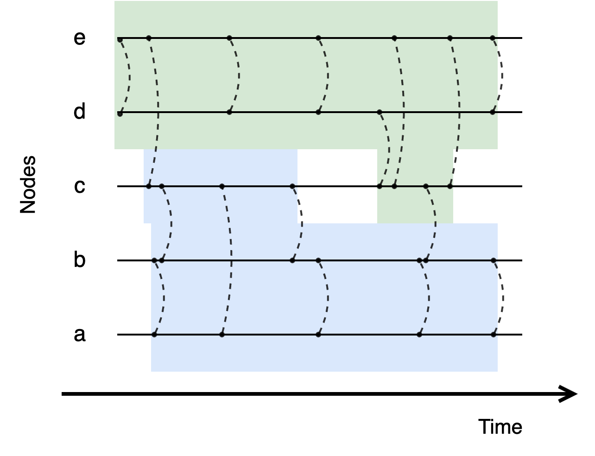

# Dynamic Community Detection: LAGO

**This library is a python implementation of the LAGO method for dynamic community detection on temporal networks.**

### Getting started using pip

**Core (algorithm only, minimal dependencies):**
```bash
pip install dcd-lago
```

**With visualization support:**
```bash
pip install dcd-lago[viz]
```


## Link Streams and Dynamic Communities

**Link stream** (or stream graph) model enables temporal network to have **perfect temporal precision** of temporal links (also called edges or interactions).

Community detection is an essential task in static network analysis. It consists in grouping nodes so there is more edges within groups than between them.
Adapating this task to temporal networks means that groups may evolve over time and yet be consistent over time. 
We call this task **Dynamic Community Detection**.


<div style="text-align: center;">
 

*Figure 1: Link stream made up of 5 nodes (a, ...,e) with time interactions over time represented with vertical dashed lines. Two dynamic communities are displayed in blue and green.*

</div>

**LAGO** (Longitudinal Agglomerative Greedy Optimization) is a method to detect dynamic communities on link streams which is inspired from most used community detection methods on static graphs. It is based on the greedy optimization of the Longitudinal Modularity, an adaptation of the Modularity quality function for communities on static networks.

## Usage 


```python
from lago import LinkStream, lago_modules, LexType
```

```python
## Declare time links according to the following format:
# <source node>, <target node>, <time instant>
## Values must be integers

time_links = [
    [2, 3, 0],
    [0, 1, 2],
    [2, 3, 3],
    [3, 4, 5],
    [2, 3, 6],
    [2, 4, 7],
    [0, 1, 8],
    [1, 2, 9],
    [3, 4, 9],
    [0, 2, 10],
    [1, 2, 11],
    [3, 4, 13],
    [1, 2, 14],
    [2, 4, 16],
    [0, 1, 17],
    [0, 1, 18],
    [2, 3, 18],
    [3, 4, 19],
]
```

```python
## Initiate empty temporal network (as a link stream)
my_linkstream = LinkStream()

## Add time links to the link stream
my_linkstream.add_links(time_links)

# NOTE time links can also be imported from txt files with the read_txt() method

## Display linkstream informations
print(f"The link stream consists of {my_linkstream.nb_edges} temporal edges (or time links) "
      f"across {my_linkstream.nb_nodes} nodes and {my_linkstream.network_duration} time steps, "
      f"of which only {my_linkstream.nb_timesteps} contain activity.")
```

```python
## Detect temporal modules
time_modules = lago_modules(
    my_linkstream,
    lex_type=LexType.MM,  # Mean-Membership expectation
    nb_iter=3,            # Run LAGO 3 times and return best result
)

# Each module contains (node, time) tuples
print(f"{time_modules.nb_modules} temporal modules have been found")

# Iterate over modules
for module in time_modules.iter_modules():
    print(f"Module {module.label}: {module.size} nodes, {module.duration} timesteps")
```

#### Plot Temporal Modules (requires dcd-lago[viz])
```python
from lago import LongitudinalModulesPlot

plot = LongitudinalModulesPlot(my_linkstream, width=1200, height=800)
plot.configure_nodes(auto_ordering=True)
plot.configure_modules(time_modules)
plot.draw()
plot.save("modules.png")
```

#### Compute Longitudinal Modularity Score
```python
from lago import longitudinal_modularity

## Compute Longitudinal Modularity score
## (the higher the better / maximum is 1)
result = longitudinal_modularity(
    my_linkstream, 
    time_modules,
    lex_type=LexType.MM,
)

print(f"Longitudinal Modularity score: {result.value}")
```

## Advanced Parameters

LAGO is a greedy method for optimizing Longitudinal Modularity, which is a quality function for dynamic communities on temporal networks. Both have many options which affects both speed and communities shapes.

### Longitudinal Modularity

 `lex` (Longitudinal Expectation):
Can be either Joint-Membership (JM) or Mean-Membership (MM). From a theoretical aspect, JM expects dynamic communities to have a very consistent duration of existence, whereas MM allows greater freedom in the temporal evolution of communities. Authors lack perspective on the impact of the choice on real data. Defaults to "MM".

 `omega`: Time resolution Parameter indicating the required level of community continuity over time. Higher values lead to more smoothness in communities changes. Defaults to 2.

### LAGO

`refinement`: In greedy search optimization, a refinement strategy can improve results but increases computation time. Defaults to STEM.

| Refinement      | Improvement | Time of execution| 
| ----------- | ----------- | --------- |
| None      |      -  | - |
| Single Time Node Movements (STNM)   | +        | +|
| Single Time Edge Movements (STEM)   | ++        | ++ |

`refinement_in`: Whether to apply refinement strategy within the main optimization loop or not. If activated, results may be improved but requires more computation time. Defaults to True.

`fast_exploration`: lighter exploration loop. If activated, it significantly reduces the time of execution but may result in poorer results. Defaults to True.


## Feedback

LAGO method and the python library are constantly improving. If you have any questions, suggestions or issues, please add them to [GitHub issues](https://github.com/fondationsahar/dynamic_community_detection/issues).

## References

### LAGO Method 

[*Discovering Communities in Continuous-Time Temporal Networks by Optimizing L-Modularity*](https://arxiv.org/abs/2510.00741) *(preprint)*
```
@misc{brabant2025discoveringcommunitiescontinuoustimetemporal,
      title={Discovering Communities in Continuous-Time Temporal Networks by Optimizing L-Modularity}, 
      author={Victor Brabant and Angela Bonifati and Rémy Cazabet},
      year={2025},
      eprint={2510.00741},
      archivePrefix={arXiv},
      primaryClass={cs.SI},
      url={https://arxiv.org/abs/2510.00741}, 
}
```

### Longitudinal Modularity

[*Longitudinal Modularity, a Modularity for Link Streams*](https://rdcu.be/eC5fA)
```
@article{Brabant2025,
  title = {Longitudinal modularity,  a modularity for link streams},
  volume = {14},
  ISSN = {2193-1127},
  url = {http://dx.doi.org/10.1140/epjds/s13688-025-00529-x},
  DOI = {10.1140/epjds/s13688-025-00529-x},
  number = {1},
  journal = {EPJ Data Science},
  publisher = {Springer Science and Business Media LLC},
  author = {Brabant,  Victor and Asgari,  Yasaman and Borgnat,  Pierre and Bonifati,  Angela and Cazabet,  Rémy},
  year = {2025},
  month = feb 
}
```