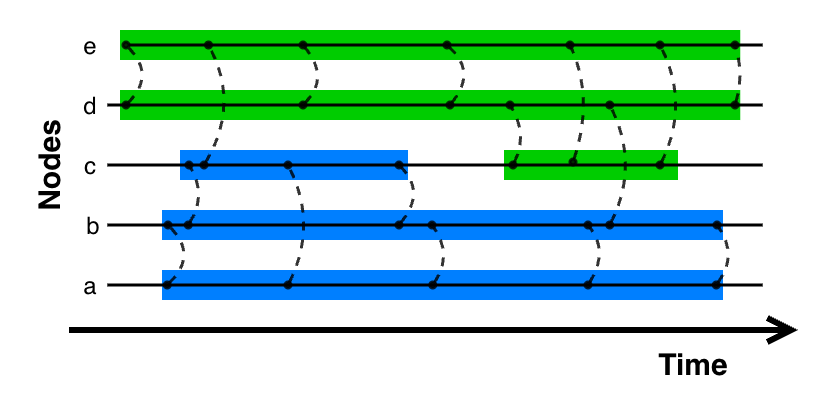

# LAGO

**Dynamic Community Detection for Temporal Networks**

[](https://pypi.org/project/dcd-lago/)
[](LICENSE.txt)
[](https://www.python.org/downloads/)

LAGO detects communities (modules) that evolve over time in fine-grained temporal networks (link streams). Unlike static methods, it finds groups that form, merge, split, and dissolve as interactions happen.

**No time window needed.** Traditional approaches require aggregating interactions into snapshots (e.g., daily or hourly networks), losing temporal precision and forcing you to choose an arbitrary window size. LAGO works directly on the raw timestamped data—no aggregation, no information loss.

<p align="center">

<br>
<em>A link stream with 5 nodes showing two dynamic communities (blue and green) that evolve over time.</em>
</p>

## Installation

```bash
pip install dcd-lago           # Core library
pip install dcd-lago[viz]      # With visualization
```

## Quick Start

```python
from lago import LinkStream, lago_modules

# Create a temporal network
ls = LinkStream()
ls.add_links([
    (0, 1, 0), (1, 2, 0), (0, 2, 0),  # Triangle at t=0
    (0, 1, 1), (1, 2, 1),              # Path at t=1
    (3, 4, 0), (3, 4, 1), (3, 4, 2),   # Pair at t=0,1,2
    (2, 3, 2),                          # Bridge at t=2
])

# Detect temporal communities
communities = lago_modules(ls)

# Explore results
for module in communities.iter_modules():
    print(f"Community {module.label}: nodes {module.nodes}, duration {module.duration}")
```

## Features

| Feature | Description |
|---------|-------------|
| **Temporal precision** | Handles exact timestamps, not time windows |
| **Quality metric** | Built-in Longitudinal Modularity scoring |
| **Flexible input** | Weighted, directed, delayed, continuous, and k-partite networks |
| **Rich output** | Track node trajectories, community evolution, and transitions |
| **Visualization** | Publication-ready longitudinal plots |

## Usage Examples

### Evaluate Community Quality

```python
from lago import longitudinal_modularity

result = longitudinal_modularity(ls, communities, lex="MM")
print(f"Quality score: {result.value:.4f}")
```

### Visualize Results

```python
from lago.viz import LongitudinalModulesPlot

plot = LongitudinalModulesPlot(ls, width=1200, height=600)
plot.configure_nodes(auto_ordering=True)
plot.configure_edges(show_activity=True)
plot.configure_communities(communities=communities)
plot.draw()
plot.save("communities.png", dpi=150)
```

### Explore Results

```python
# Track a specific node
trajectory = communities.get_node_trajectory(node_id=0)
print(f"Node 0 was in communities: {trajectory}")

# Get community membership at a specific time
membership = communities.get_nodes_modules_membership_at_time(time=1)
print(f"At t=1: {membership}")

# Save/load results
communities.to_json("results.json")
```

## Key Parameters

### `lago_modules()`

| Parameter | Default | Description |
|-----------|---------|-------------|
| `lex` | `"MM"` | Expectation type: `"MM"` (flexible) or `"JM"` (stable communities) |
| `omega` | `2` | Temporal smoothness (higher = fewer community switches) |
| `gamma` | `1` | Resolution (higher = smaller communities) |
| `refinement` | `"STEM"` | Refinement strategy: `None`, `"STNM"`, or `"STEM"` |
| `nb_iter` | `1` | Number of runs (keeps best result) |

### `longitudinal_modularity()`

| Parameter | Default | Description |
|-----------|---------|-------------|
| `lex` | `"MM"` | Expectation type: `"MM"`, `"JM"`, or `"CM"` |
| `omega` | `2.0` | Weight for temporal penalty |
| `gamma` | `1.0` | Weight for expectation term |

## Documentation

📖 **Guides**
- [Getting Started](examples/01_getting_started.md) — Concepts and first steps
- [API Reference](docs/API_REFERENCE.md) — Complete function documentation

📁 **Examples** ([examples/](examples/))
- [LinkStream Types](examples/02_linkstream_types.ipynb) — Weighted, directed, continuous, delayed, k-partite networks
- [Community Detection](examples/03_community_detection.ipynb) — Using `lago_modules` and exploring results
- [Modularity](examples/04_modularity.ipynb) — Computing and understanding quality scores
- [Visualization](examples/05_visualization.ipynb) — Creating publication-ready plots

💡 **Practical Guides**
- [Real-World Preprocessing](examples/real_world_preprocessing.ipynb) — Working with names and date strings

All examples are interactive Jupyter notebooks. Run `jupyter notebook` in the examples folder to get started!

📄 **Papers**
- [LAGO Method (arXiv)](https://arxiv.org/abs/2510.00741) — Algorithm details and experiments
- [Longitudinal Modularity (EPJ Data Science)](https://rdcu.be/eC5fA) — Quality function theory

## Citation

If you use LAGO in your research, please cite:

**LAGO Method:**
```bibtex
@misc{brabant2025lago,
    title={Discovering Communities in Continuous-Time Temporal Networks by Optimizing L-Modularity}, 
    author={Victor Brabant and Angela Bonifati and Rémy Cazabet},
    year={2025},
    eprint={2510.00741},
    archivePrefix={arXiv},
    primaryClass={cs.SI},
}
```

**Longitudinal Modularity:**
```bibtex
@article{Brabant2025lmod,
    title={Longitudinal modularity, a modularity for link streams},
    author={Brabant, Victor and Asgari, Yasaman and Borgnat, Pierre and Bonifati, Angela and Cazabet, Rémy},
    journal={EPJ Data Science},
    volume={14},
    number={1},
    year={2025},
    doi={10.1140/epjds/s13688-025-00529-x},
}
```

## Contributing

Questions, suggestions, or issues? Please open a [GitHub issue](https://github.com/fondationsahar/dynamic_community_detection/issues).

## License

MIT License — see [LICENSE.txt](LICENSE.txt)
